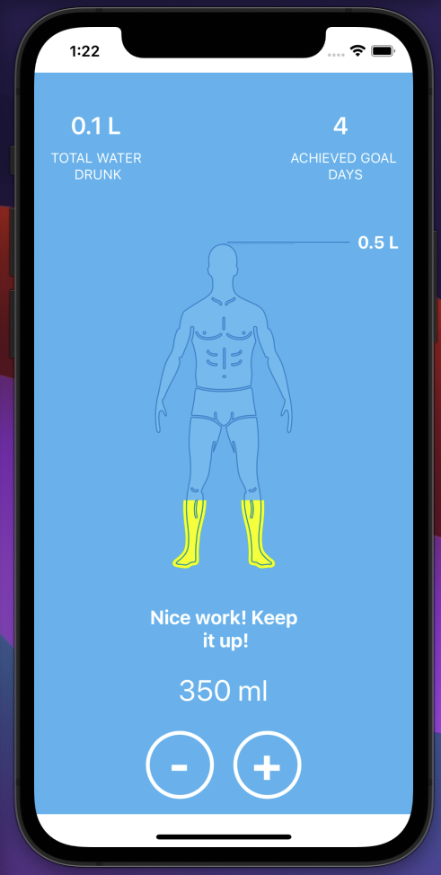

# CaraCare
CaraCare code challenge. 

# Introduction.
This is a simple Water tracker app built with expo (react native.)

# Setup
- download this repo
- run yarn or npm install in the root directory.
- run expo start
- in terminal hit `i`

note: ensure you have emulator running on your machine or expo go installed on your mobile device, also ensure both phone and pc is on the same network connection.

# notable possible improvment;
- write test
- find a better way to animate the svg path than using view height
